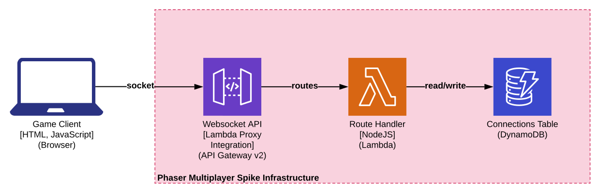
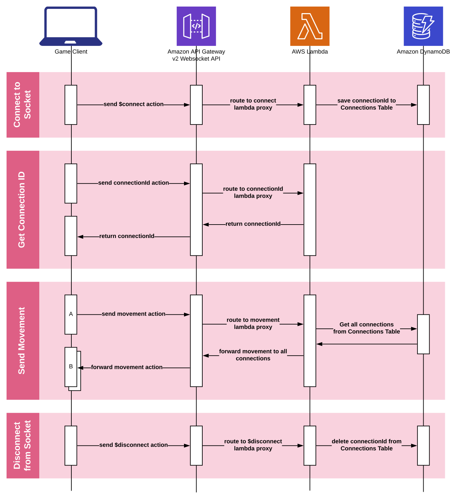

# Phaser Multiplayer Spike Infrastructure

> ℹ️ This is the companion repository to the [Phaser Multiplayer Spike](https://github.com/ardelio/phaser-multiplayer-spike) repository.

## Overview

This project provides a Websocket Service for use by the Phaser3 Game Client and supports the following behaviour:

- Connect to the world server.
- Retrieve the Connection ID.
- Send Movement details to other Game Clients.
- Disconnect from the world server.

> ℹ️ You can take this and run it yourself, scoll down for *Deployment* instructions.

## Goal

- Implement character movement between 2 or more Game Clients.
- Provide a relatively low latency, *good enough*, solution.
- Limit the costs, preferably all free tier services and consumption.

## Architecture

As this project was a spike, it was built entirely in AWS using low cost, pay-for-what-you-use serveless services, which include:

- ApiGateway
- Lambda
- DynamoDB

The architecture can be visualised as:



The workflow can be visualised as:



## Deployment

This project uses Terraform, convenience scripts have been added to the package.json file.

Terraform will simply use local state.

### Dependencies

- Terraform 0.12.x

### Instructions

If this is your first time, run (otherwise skip this step):

```sh
npm run deploy:init
```

To package the Lambda's, run:

```sh
npm run package
```

To deploy the stack, with an approval step, run:

```sh
npm run deploy
```

To deploy the stack, foregoing the approval step, run:

```sh
npm run deploy:approve
```

To destroy the stack, run:

```sh
npm run destroy
```